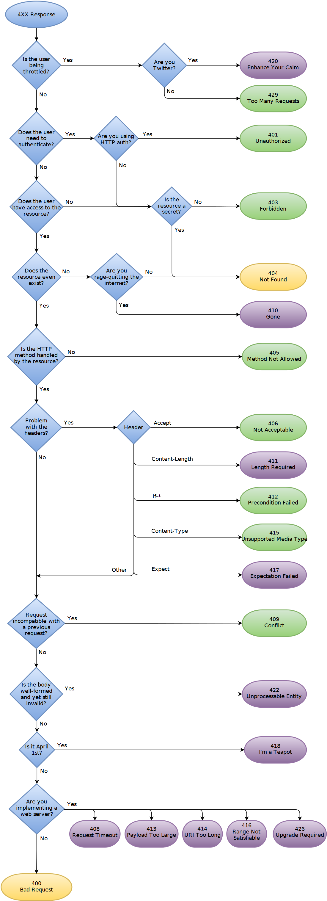

## Mapbox Clustering

> 지도 클러스터링 기능을 사용해야 하기에 문서 확인

### 🔹백터 타일

Mapbox의 GeoJSON 파일은 클라이언트에 의해 벡터 타일로 변환된다. 이를 효율적으로 로드하고 렌더링 하기 위해 클러스터링은 필수!

추가 성능 개선을 위한 자료는 아래의 링크를 참고하자.

https://docs.mapbox.com/help/troubleshooting/mapbox-gl-js-performance/

### 🔹cluster

- option 항목
- 기본 값은 `false`
- 반지름을 기준으로 포인트가 그룹으로 군집화
- `cluster_id` : 클러스터 유니크 id
- `point_count` : 그룹화된 포인트 수
- `point_count_abbreviated` : 축약된 포인트 수

### 🔹lusterMaxZoom

- 클러스터링이 활성화 된 경우 클러스터링할 지점의 최대 확대/축소 값

### 🔹clusterMinPoints

- 클러스터 형성하는데 필요한 최소 포인트 수

### 🔹clusterProperties

- 클러스터링이 활성화된 경우 생성된 클러스터에서 사용자 지정 속성을 정의하고 클러스터링 된 지점에서 값을 집계하는 개체

### 🔹clusterRadius

- 클러스터의 반경(반지름)

### 🔹data

- GeoJSON 파일 또는 그 URL

### 🔹filter

- 기능 필터링을 위한 식

### 🔹tolerance

- 단순화 공차, 높을수록 형상이 단순해지고 속도가 빨라짐

 

## 날짜 및 시간 데이터 타입

### 🔹DATE

**_`YYYY-MM-DD`_**

### 🔹DATETIME

**_`YYYY-MM-DD hh:mm:ss`_**

### 🔹TIMESTAMP

타임존에 기반한 날짜를 제공한다.

**_`YYYY-MM-DD hh:mm:ss`_**

 

---

## HTTP 응답 코드

참고 글

https://tecoble.techcourse.co.kr/post/2020-08-31-http-status-code/
