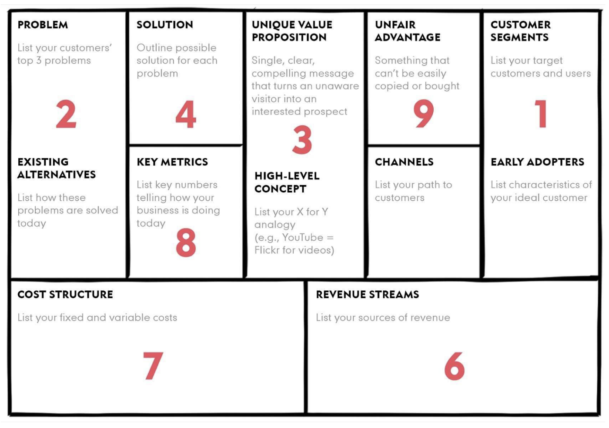
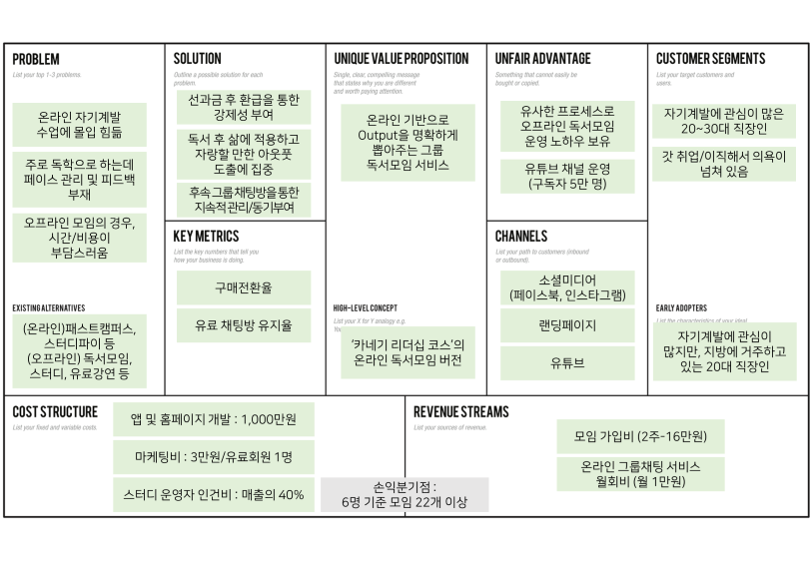

## 2023-09-04
### lecture

---
###
---
### Final Project
- 칸반,일정 작성
- 모델링 go
- lean canvas
  - [린 캔버스의 정의와 작성순서 및 작성사례](https://kbizplan.com/%EB%A6%B0-%EC%BA%94%EB%B2%84%EC%8A%A4lean-canvas%EC%9D%98-9%EA%B0%80%EC%A7%80-%EB%B8%94%EB%A1%9D-%EC%A0%95%EC%9D%98%EC%99%80-%EC%9E%91%EC%84%B1%EC%88%9C%EC%84%9C-%EB%B0%8F-%EC%9E%91%EC%84%B1/)
  - [린 캔버스 작성 순서 by Ash Maurya](https://blog.leanstack.com/what-is-the-right-fill-order-for-a-lean-canvas/)
  - [lean canvas](https://acquiredentrepreneur.tistory.com/21)
  
  1. [Customer Segments (고객 세그먼트)](https://acquiredentrepreneur.tistory.com/10)
     - 목표 고객 정의 -> 고객군 구체화 -> 얼리어답터?
  2. [Problem (고객 문제)](https://acquiredentrepreneur.tistory.com/3)
     - 고객군이 해결해야 할 핵심 문제 1~3가지 정의.
  3. Unique Value Proposition (고유한 가치제안)
     - '비인지 방문자를 관심있는 가망 고객으로 변화시킬 단순하고 설득력 있는 메시지'     
  4. Solution (고객 문제에 대한 솔루션)
     - 고객 문제가 명확하게 검증된 이후 고민
  5. [Channel](https://acquiredentrepreneur.tistory.com/9)
     - 제품/서비스가 어떤 경로로 고객이 인지하고 구매하는지 정의
  6. [Revenue Streams (수익원)](https://acquiredentrepreneur.tistory.com/13)
     - 제품/서비스의 수익 원천 정의. 수익원에 대한 가격/지불방식도 정의 추후에 솔루션과 같이 검증
  7. [Cost Structure (비용구조)](https://acquiredentrepreneur.tistory.com/12)
     - 제품 출시하기까지 필요한 운영 비용. 고정비와 변동비로 구분해서 목록
  8. Key Metric (핵심지표)
     - 사업의 성과를 측정하는데 핵심 역할을 하는 지표를 정의
     - 서비스 내 고객인지부터 획득,활성화,유지,매출,추천등 과정에서의 활동을 
     - 정의하고 이중 핵심 활동에 대한 피표를 정의  
  9. Unfair Advantage (차별적 경쟁우위)
     - 다른 제품들이 쉽게 따라할 수 없는 기능등을 정의.
     - 경쟁우위
       - 내부자 정보
       - 적절한 '전문가'의 지지
       - 환상적인 팀
       - 개인적인 권위
       - 대규모 네트워크 효과
       - 커뮤니티
       - 기존 고객
       - 검색 엔진 최적화 순위
  10. 예시
  - 

 
 
 
 
 
 
 
 
 
 
 
 
 
 
 
 
 
 
 
 
 
 
 
 
 
 
 
 

