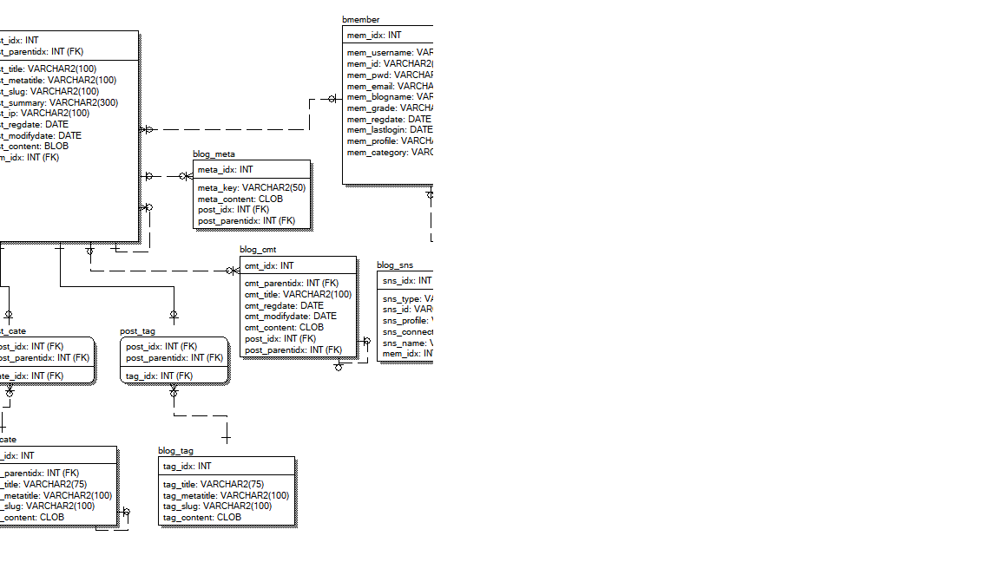

### 2023-09-08

---

### fin project

- 모델링 작업중
  - 
- 개인 프로젝트라 심플하게 해도 되지만 경험상 칸반과 타임라인을 작성해보고 데드라인을 지켜본다.
    - [내 프로젝트 타임라인](https://www.notion.so/bd2639e31d9940729f0a4e7f5af61e5b?pvs=21)
    - [내 작업 타임라인](https://www.notion.so/9e166d557e834743897e70cbd5b15fb9?pvs=21)
    - [내 작업 칸반](https://www.notion.so/9e166d557e834743897e70cbd5b15fb9?pvs=21)
- 조사
    - [Mustache](https://mustache.github.io/)
        - [[SpringBoot] Mustache](https://m.blog.naver.com/nuberus/221884812398)
    - [Browser Rendering Process](https://velog.io/@soom/Browser-Rendering-Process)
    - [HTTP/1 HTTP/2, HTTP/3](https://velog.io/@seyoung8239/HTTP1.1-HTTP2-HTTP3)
- 번외(일과?시간외)
    - [Chromium build](https://www.notion.so/3d8295829e79459899b475d4288bafcc?pvs=21)
        - 건드릴 영역은 아니지만 잠깐 소스를 보았다